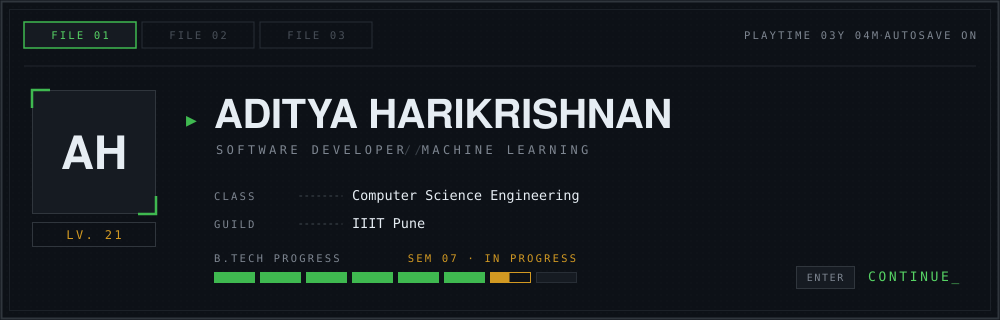
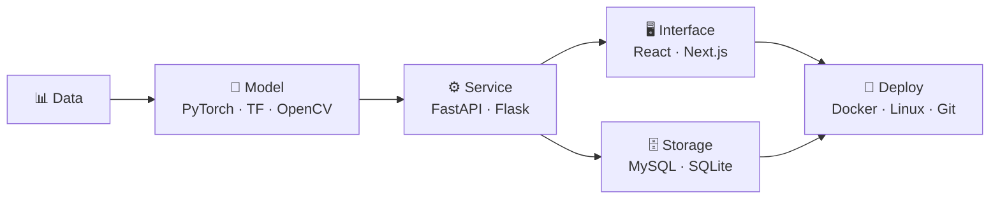

<!-- ======================= SAVE FILE BANNER ======================= -->
<!-- Custom SVG lives in this repo at assets/save-file.svg -->



<div align="center">


<br/>

<a href="https://www.linkedin.com/in/aditya-harikrishnan/"></a>
<a href="https://adityaharikrishnan.vercel.app/">
  
</a>
<a href="mailto:adityaharikrishnan@gmail.com"></a>


</div>

---

## 🎭 &nbsp;Character Sheet

> I like the part of the stack where research meets production. Training a segmentation network is only half the job — the other half is serving it behind an API that doesn't fall over under load. Most of what I build sits somewhere on that line.

Computer Science undergrad at **IIIT Pune**, splitting time between deep learning research and backend engineering. My projects usually start with a paper or a dataset and end with something you can actually send a request to. Outside the terminal I'm probably playing something with a good progression system — which is how Ludex happened.

```
┌─ ATTRIBUTES ──────────────────────────────────────────────┐
│                                                           │
│   DEEP LEARNING          ████████████████░░░░   Primary    │
│   BACKEND ENGINEERING    ███████████████░░░░░   Primary    │
│   COMPUTER VISION        ██████████████░░░░░░   Secondary  │
│   RECOMMENDER SYSTEMS    █████████████░░░░░░░   Secondary  │
│   SYSTEM DESIGN          ██████████░░░░░░░░░░   Training   │
│   MLOps / DEPLOYMENT     ████████░░░░░░░░░░░░   Training   │
│                                                           │
└───────────────────────────────────────────────────────────┘
```

<table width="100%">
<tr>
<td width="50%" valign="top">

#### 🎓 &nbsp;Origin Story
**B.Tech, Computer Science**  
IIIT Pune

</td>
<td width="50%" valign="top">

#### 🌱 &nbsp;Currently Grinding
MLOps, model serving at scale, and distributed systems design

</td>
</tr>
</table>

---

## 🎒 &nbsp;Inventory

#### 💻 &nbsp;Languages

<table>
<tr>
<td align="center" width="100"><br/><sub><b>Python</b></sub></td>
<td align="center" width="100"><br/><sub><b>Java</b></sub></td>
<td align="center" width="100"><br/><sub><b>JavaScript</b></sub></td>
<td align="center" width="100"><br/><sub><b>C</b></sub></td>
<td align="center" width="100"><br/><sub><b>HTML5</b></sub></td>
<td align="center" width="100"><br/><sub><b>CSS3</b></sub></td>
</tr>
</table>

#### 🧠 &nbsp;ML Toolkit

<table>
<tr>
<td align="center" width="100"><br/><sub><b>PyTorch</b></sub></td>
<td align="center" width="100"><br/><sub><b>TensorFlow</b></sub></td>
<td align="center" width="100"><br/><sub><b>OpenCV</b></sub></td>
<td align="center" width="100"><br/><sub><b>scikit-learn</b></sub></td>
</tr>
</table>

#### ⚙️ &nbsp;Frameworks

<table>
<tr>
<td align="center" width="100"><br/><sub><b>FastAPI</b></sub></td>
<td align="center" width="100"><br/><sub><b>Flask</b></sub></td>
<td align="center" width="100"><br/><sub><b>React</b></sub></td>
<td align="center" width="100"><br/><sub><b>Next.js</b></sub></td>
</tr>
</table>

#### 🗄️ &nbsp;Data

<table>
<tr>
<td align="center" width="100"><br/><sub><b>MySQL</b></sub></td>
<td align="center" width="100"><br/><sub><b>SQLite</b></sub></td>
</tr>
</table>

#### 🧰 &nbsp;Utility Belt

<table>
<tr>
<td align="center" width="100"><br/><sub><b>Git</b></sub></td>
<td align="center" width="100"><br/><sub><b>GitHub</b></sub></td>
<td align="center" width="100"><br/><sub><b>Docker</b></sub></td>
<td align="center" width="100"><br/><sub><b>Linux</b></sub></td>
<td align="center" width="100"><br/><sub><b>VS Code</b></sub></td>
<td align="center" width="100"><br/><sub><b>Postman</b></sub></td>
</tr>
</table>

<br/>



---

## 🗺️ &nbsp;Quest Log

<table width="100%">
<tr>

<td width="50%" valign="top">

### 🧬 &nbsp;Modified Double U-Net

`MAIN QUEST` &nbsp;·&nbsp; **Difficulty** ★★★★☆

> Enhanced Double U-Net architecture for **medical image segmentation** — stacked encoder–decoder blocks with squeeze-and-excitation and ASPP-style context capture, implemented end-to-end in PyTorch.


<a href="https://github.com/Aditya11835/Modified_DoubleUNet_Implementation"></a>

</td>

<td width="50%" valign="top">

### 🎮 &nbsp;Ludex

`SIDE QUEST` &nbsp;·&nbsp; **Difficulty** ★★★☆☆

> Hybrid **recommendation engine** for Steam. Content-based TF-IDF signals fused with Implicit ALS collaborative filtering, so cold-start users still get sensible picks instead of the same twenty bestsellers.


<a href="https://github.com/Aditya11835/Ludex"></a>

</td>

</tr>
<tr>

<td width="50%" valign="top">

### 🚶 &nbsp;Gait Multi-Modal Fusion

`MAIN QUEST` &nbsp;·&nbsp; **Difficulty** ★★★★☆

> Deep learning framework for **gait recognition** across multiple modalities, using feature-level fusion to stay accurate when any single modality degrades.


<a href="https://github.com/AdityaH1305/Gait-Multi-Modal-Fusion"></a>

</td>

<td width="50%" valign="top">

### 🚁 &nbsp;SynthRescue

`RAID` &nbsp;·&nbsp; **Difficulty** ★★★★★

> AI disaster-response platform: **YOLO** detection over aerial imagery piped into Gemini for situational reasoning, served through a FastAPI backend with a Next.js operator dashboard.


<a href="https://github.com/AdityaH1305/SynthRescue"></a>

</td>

</tr>
</table>

---

## 🏆 &nbsp;Achievements Unlocked

<table width="100%">
<tr>
<td colspan="2" align="center">


**🥇 &nbsp;Launch Sequence** &nbsp;·&nbsp; <sub>LEGENDARY</sub>  
<sub>Applied machine learning research internship at the Indian Space Research Organisation</sub>

</td>
</tr>
<tr>
<td width="50%" align="center">


**☁️ &nbsp;Head in the Clouds** &nbsp;·&nbsp; <sub>RARE</sub>  
<sub>Azure Fundamentals — cloud infrastructure &amp; core services</sub>

</td>
<td width="50%" align="center">


**📜 &nbsp;Wrote the Manual** &nbsp;·&nbsp; <sub>RARE</sub>  
<sub>Technical documentation on hybrid recommendation systems</sub>

</td>
</tr>
</table>

---

## ⏱️ &nbsp;Playtime

<div align="center">


</div>

---

## 🐍 &nbsp;Speedrun Route

<div align="center">

</div>

---

## 🎮 &nbsp;Join the Party

<div align="center">

<a href="https://www.linkedin.com/in/aditya-harikrishnan/">
  
</a>

<a href="mailto:adityaharikrishnan@gmail.com">
  
</a>

<a href="https://adityaharikrishnan.vercel.app/">
  
</a>

</div>

```
▸ SAVE FILE UPDATED    ·    THANKS FOR PLAYING
```

<div align="center">
<sub><i>"Building software that is scalable, intelligent and impactful."</i></sub>
</div>
