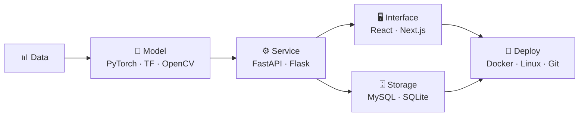

<!-- ============================ HEADER ============================ -->


<div align="center">


<br/>

<a href="https://www.linkedin.com/in/aditya-harikrishnan/"></a>
<a href="https://adityaharikrishnan.vercel.app/"></a>
<a href="mailto:adityaharikrishnan@gmail.com"></a>


</div>

---

## 🧠 About

```python
from dataclasses import dataclass, field

@dataclass
class Aditya:
    role:     str  = "Software Developer"
    edu:      str  = "B.Tech CSE @ IIIT Pune"
    focus:    list = field(default_factory=lambda: [
        "Deep Learning & Computer Vision",
        "Backend architecture & scalable APIs",
        "Recommender systems",
    ])
    stack:    list = field(default_factory=lambda: ["Python", "PyTorch", "FastAPI", "Next.js"])
    learning: list = field(default_factory=lambda: ["MLOps", "Distributed Systems", "Model Serving at Scale"])

    def philosophy(self) -> str:
        return "Ship it, measure it, then make it fast."
```

I like the part of the stack where research meets production — training a segmentation network is only half the job, the other half is serving it behind an API that doesn't fall over. Most of what I build sits somewhere on that line.

<br/>



---

## ⚡ Tech Stack

<table width="100%">
<tr>
<td width="150" valign="middle"><b>Languages</b></td>
<td></td>
</tr>
<tr>
<td valign="middle"><b>ML / AI</b></td>
<td></td>
</tr>
<tr>
<td valign="middle"><b>Frameworks</b></td>
<td></td>
</tr>
<tr>
<td valign="middle"><b>Data</b></td>
<td></td>
</tr>
<tr>
<td valign="middle"><b>Tooling</b></td>
<td></td>
</tr>
</table>

---

## 🚀 Featured Work

<table width="100%">
<tr>

<td width="50%" valign="top">

### 🧬 Modified Double U-Net

> Enhanced Double U-Net architecture for **medical image segmentation** — encoder–decoder stacking with squeeze-and-excitation and ASPP-style context capture, implemented end-to-end in PyTorch.


<a href="https://github.com/Aditya11835/Modified_DoubleUNet_Implementation"></a>

</td>

<td width="50%" valign="top">

### 🎮 Ludex

> Hybrid **recommendation engine** for Steam. Content-based TF-IDF signals fused with Implicit ALS collaborative filtering to handle cold-start users without losing personalization.


<a href="https://github.com/Aditya11835/Ludex"></a>

</td>

</tr>
<tr>

<td width="50%" valign="top">

### 🚶 Gait Multi-Modal Fusion

> Deep learning framework for **gait recognition** across multiple modalities, with feature-level fusion to stay robust where any single modality degrades.


<a href="https://github.com/AdityaH1305/Gait-Multi-Modal-Fusion"></a>

</td>

<td width="50%" valign="top">

### 🚁 SynthRescue

> AI disaster-response platform: **YOLO** detection over aerial imagery piped into Gemini for situational reasoning, served through a FastAPI backend and a Next.js operator dashboard.


<a href="https://github.com/AdityaH1305/SynthRescue"></a>

</td>

</tr>
</table>

---

## 📊 GitHub Activity

<div align="center">


</div>

---

## 🐍 Contribution Graph

<div align="center">

</div>

---

## 🏆 Highlights

<table width="100%">
<tr>
<td width="50%" align="center">
<br/>
<sub><b>Indian Space Research Organisation</b><br/>Applied ML research internship</sub>
</td>
<td width="50%" align="center">
<br/>
<sub><b>Azure Fundamentals</b><br/>Cloud infrastructure &amp; services</sub>
</td>
</tr>
<tr>
<td align="center">
<br/>
<sub><b>Technical Documentation</b><br/>Hybrid recommendation systems</sub>
</td>
<td align="center">
<br/>
<sub><b>End-to-End Delivery</b><br/>Multiple production-style applications</sub>
</td>
</tr>
</table>

---

## 🤝 Connect

<div align="center">

<a href="https://www.linkedin.com/in/aditya-harikrishnan/"></a>
<a href="mailto:adityaharikrishnan@gmail.com"></a>
<a href="https://adityaharikrishnan.vercel.app/"></a>

<br/><br/>

<i>"Building software that is scalable, intelligent and impactful."</i>

</div>


